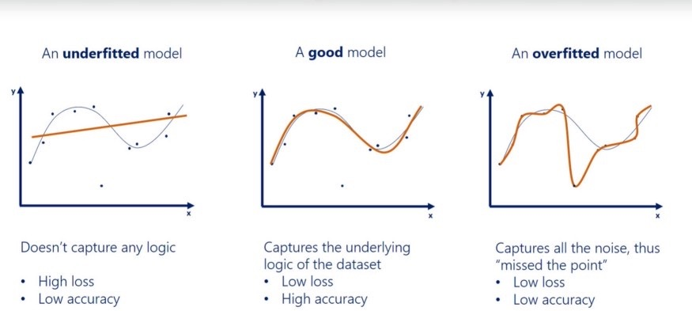

- 内存溢出
    - [一行代码缓解OOM](https://mp.weixin.qq.com/s/VBagnjXBVp135nBMfAyk5Q)
- 分布式训练
  - [大模型分布式训练实践](https://mp.weixin.qq.com/s/SN6_uOsj18_5JZIKRYFkzA)
  - [框架中的分布式训练](https://mp.weixin.qq.com/s/yJSmWe3jMGdrAYERjeNiLQ)
- 模型过拟合
  -  
  - 一般情况下模型的参数远远大于数据量的时候会出现过拟合的现象，这个时候可以考虑数据侧（使用数据增强增加训练数据量、采用交叉验证、使用特征筛选移除一些特征），模型侧（采用集成方法、减少模型参数量、加入L1、L2正则、加入层标准化、批量标准化、使用早停机制、dropout等方法来缓解模型过拟合现象）
  - 这里需要知道归一化和标准化是不一样的，归一化一般是为了限定取值范围，防止数据种存在异常值或者不同特征之间的量纲不同对模型带来的消极影响（将值限定在一定数值区间，可以看作一种量化技术，也即将更大的取值限定到0~1之间），标准化一般是为了限定数据的分布，给定数据一个强制的先验假设，也即数据服从某个特定的正态分布，这样可以加速模型的收敛速度，并能在一定程度上缓解模型过拟合的现象
  - [10种常用方法用于缓解过拟合](https://mp.weixin.qq.com/s/ErJc-qMRlea58iVby40aSA)
  - [金融量化防止过拟合](https://mp.weixin.qq.com/s/VXUCMIgNwGhYvHBdYQ1BFw)
  - [缓解模型过拟合](https://mp.weixin.qq.com/s/DygvuXbSL-798VH4czJspA)
  - [防止模型过拟合的技术汇总](https://mp.weixin.qq.com/s/gpNvRpRKSWLfDp2g13siUw)
  - [防止模型过拟合方法](https://mp.weixin.qq.com/s/CrmIWRtTnN_uzdCySRma0g) 

- 多损失
  - [多损失训练](https://mp.weixin.qq.com/s/INDbcDcQ5SKwe9lOeYrSng)
- 数据不平衡问题
  - [深入研究不平衡回归问题](https://mp.weixin.qq.com/s/xiI5NG-2rmiePMELMU7GFw)
- 炼丹效率
  - [炼丹效率](https://mp.weixin.qq.com/s/kwhx9DxuORDvh0p5vz8oRA)
- Cuda OOM
  - [CUDA OOM](https://mp.weixin.qq.com/s/ecOtxBYcY2b-c30sHgFtMQ) 
  
- 大模型幻觉问题
  - [大模型微调的危害](https://mp.weixin.qq.com/s/d8dWpfdLDJ_0xZzTW3TPRw)

- 大模型推理问题
  - [端到端推理](https://mp.weixin.qq.com/s/LJWxzDMdkcar61-rOnzD4A)
